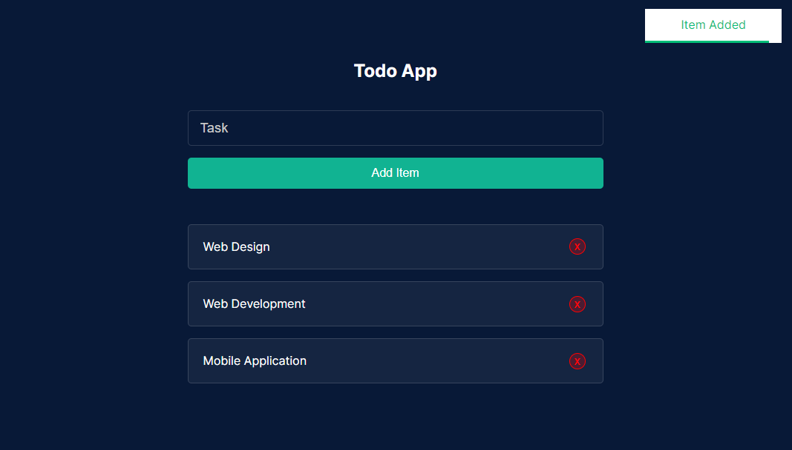
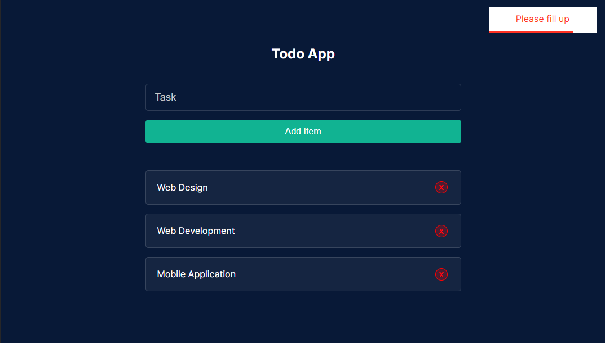
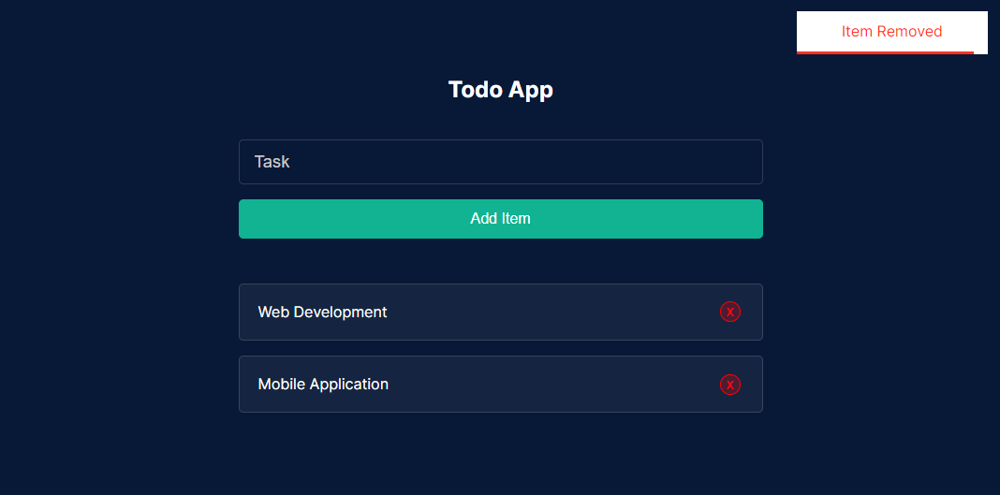

# Simple Todo app with React JS (Vite JS) #

** This project installed via Vite  **


### Installatio Guide ⚡

> Using Command Line.

```
  npm install
  npm run dev 
  npm run build
```

## App Result 

> When item is added


> When field is empty


> When item is removed
